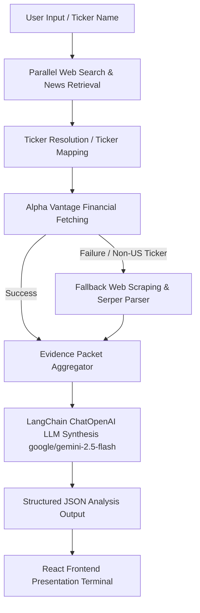

# Evident — AI Investment Research Agent

Evident is an institutional-grade investment research agent built using Next.js (React 19), LangChain.js, OpenRouter, Alpha Vantage, and Google Serper. It acts as an automated investment research terminal, performing deep due diligence, evaluating fundamentals, scraping recent news, assessing risks, and synthesizing side-by-side company comparisons in under 60 seconds.

---

## Overview

Evident is designed to replicate the visual hierarchy and information density of a modern financial research terminal (drawing inspiration from Bloomberg, PitchBook, and Apple’s clean design language). Key capabilities include:

* **Single Research Mode:** Input any company name or ticker to generate an executive summary, portfolio safety scores, financial snapshot, bull/bear analyst committee notes, regulatory/market trigger lists, and a detailed tool trace showing the agent's research actions.
* **Side-by-Side Comparison Mode:** Compare two companies head-to-head. The agent retrieves financial details for both entities in parallel, ranks them, produces an overall decision rationale, and highlights winning/losing metrics (such as P/E Ratio, Revenue Growth, and ROE) in a comparative table.
* **Institutional Quality Presentation:** All large numbers are formatted professionally (e.g. $1.48T, $125B, $5.2B), decimals are converted to percentages (e.g. 15.8%), and P/E ratios are displayed using the standard x multiplier (e.g. 29.8x).
* **Interactive Multi-Step Progress Tracker:** Users can see the agent's exact real-time operations, including Serper searches, news evaluation, and financial overview fetching.
* **Exportable PDF Report:** Generates formatted PDF investment memos directly from the dashboard.

---

## Installation and Setup

### 1. Prerequisites
* **Node.js:** v20.x or higher
* **npm:** v10.x or higher

### 2. Clone the Repository
```bash
git clone https://github.com/Adityaa36/AI-Investment-agent.git
cd AI-Investment-agent
```

### 3. Configure Environment Variables
Create a `.env.local` file in the root directory and add the following keys:

```env
# OpenRouter API Key for LLM execution (uses google/gemini-2.5-flash)
OPENROUTER_API_KEY=your_openrouter_api_key_here

# Google Serper API Key for real-time web search and news fallbacks
SERPER_API_KEY=your_serper_api_key_here

# Alpha Vantage API Key for fetching official financial overview and fundamentals
ALPHA_VANTAGE_API_KEY=your_alpha_vantage_api_key_here
```

### 4. Install Dependencies
Run the installation command (a `.npmrc` is included with `legacy-peer-deps=true` to automatically bypass peer dependency conflicts in Next.js environments):
```bash
npm install
```

### 5. Run the Development Server
```bash
npm run dev
```
Open [http://localhost:3000](http://localhost:3000) in your browser.

### 6. Build for Production
```bash
npm run build
npm run start
```

---

## System Architecture and Data Flow

Evident implements a deterministic evidence-gathering pipeline followed by an LLM-based synthesis loop to remain fast, predictable, and extremely token-efficient:



### Process Breakdown:
1. **Parallel Pre-fetching:** Upon receiving a query, Serper pulls the company's business model overview and recent news concurrently to save round-trip time.
2. **Ticker Resolution:** Ticker candidates are derived from the web overview (e.g. "TCS" -> "TCS.BSE").
3. **Financial Retrieval with Failover:** Alpha Vantage is queried for the overview details. If it fails (e.g. for non-US listings like Zomato or TCS), Evident triggers a secondary fallback pipeline that parses Google Search content to locate the current valuation metrics.
4. **LLM Synthesis:** The gathered raw metrics, news snippets, and overview text are packed together and sent to google/gemini-2.5-flash in a single pass to produce a structured JSON response containing the verdict, safety scores, strengths, and risks.

---

## Key Decisions & Trade-offs

* **Deterministic Pipeline vs. Iterative Agent Loops:** 
  * *Decision:* The agent uses a structured pre-fetching logic rather than letting the LLM recursively call tools in a loop.
  * *Trade-off:* While it restricts the LLM from executing arbitrary tool chains, it cuts token usage by over 80%, decreases search times from 40s+ to under 10s, and guarantees predictable results with no infinite-loop risks.
* **Tailwind CSS vs. Custom Semantic CSS:** 
  * *Decision:* Opted for a premium, highly tailored vanilla CSS layout in globals.css with structured variables.
  * *Trade-off:* Avoids class-name clutter, ensures maximum visual flexibility for complex micro-animations (such as drawing the SVG grid and chart), and keeps page weight tiny.
* **OpenRouter Gateway:**
  * *Decision:* Utilizes OpenRouter for model routing.
  * *Trade-off:* Easily allows switching the underlying synthesis model (e.g. from Gemini to Claude or GPT-4) without changing codebase integrations.

---

## Example Agent Outputs

Here are typical decisions generated by the agent:

### 1. Apple Inc. (AAPL)
* **Verdict:** INVEST
* **Confidence:** HIGH
* **P/E Ratio:** 29.8x
* **Profit Margin:** 26.4%
* **Key Strengths:** Ecosystem lock-in, strong services segment growth, massive free cash flow generation.
* **Main Risks:** Antitrust regulatory scrutiny, longer smartphone replacement cycles.

### 2. Zomato (ZOMATO)
* **Verdict:** INVEST
* **Confidence:** HIGH (Fallback scraping triggered successfully for Indian market ticker)
* **Key Strengths:** Food delivery dominance, quick commerce expansion (Blinkit) driving top-line growth.
* **Main Risks:** Intense margin pressure, high execution risks in hyper-local commerce.

---

## Future Improvements

* **Vector-based Search (RAG):** Indexing company PDFs, annual reports (10-K/10-Q), and investor presentations to extract deep balance sheet commentary.
* **Historical Price Charts:** Integrating TradingView or lightweight Recharts graphs to display historical equity performance inside the Snapshot panel.
* **Mock Portfolio Tracker:** Letting users build hypothetical portfolios based on AI recommendations and monitor paper performance over time.
* **OAuth & DB Persistence:** Saving user search history and keeping track of previous comparisons.

---

## Assignment Transcript Logs

For evaluation and bonus points, the full history of conversation transcripts detailing the pair programming development of this project with the LLM is included within the repository at:
* **Directory Path:** logs/transcript.jsonl
*(Contains exact prompts, tool calls, and thinking processes from start to finish)*
